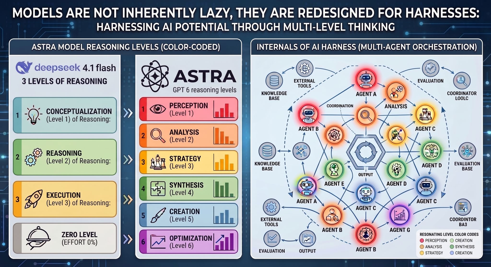

# [Join cheaperuh party](https://join.cheaperuh.party)

Join cheaperuh (čipera) PARTY tests a cost-conscious supervisor: can it look at a vague task description and choose the least expensive reasoning effort likely to succeed?



## The idea

The worker model has freedom to use any OpenRouter-supported reasoning setting, including zero reasoning. The supervisor does not see the detailed benchmark prompt or answer. It sees only a short, deliberately vague brief such as "a user reports a small localized code defect" and selects one effort.

The worker then attempts the hidden task three times at that selected effort. This happens three times independently per task, producing a 3 x 3 matrix:

| Matrix axis | Meaning |
|---|---|
| 3 supervisor choices | Three independent cost-aware choices from the vague brief. |
| 3 attempts per choice | Three worker attempts at the chosen effort. |

This measures adaptive reasoning allocation, rather than assuming the correct level is known in advance.

## Reasoning choices

The target is `deepseek/deepseek-v4.1-flash` through OpenRouter. The supervisor may return any gateway-supported setting:

| Effort | Role in the demo |
|---|---|
| `none` | Zero reasoning baseline for extraction, formatting, and one-line repairs. |
| `minimal` | A small amount of deliberate work. |
| `low` | Short calculations and explicit rules. |
| `medium` | Multi-step but bounded constraints. |
| `high` | Stateful and dependency-heavy reasoning. |
| `xhigh` | Debugging and harder diagnosis. |
| `max` | Reserve for the genuinely difficult cases. |

OpenRouter validates these named values. It does not accept the model's native numeric 1-100 effort values through its chat-completions gateway. See the [OpenRouter reasoning guide](https://openrouter.ai/docs/guides/best-practices/reasoning-tokens), [OpenRouter model page](https://openrouter.ai/deepseek/deepseek-v4.1-flash), and [DeepSeek V4.1 reference](https://huggingface.co/deepseek-ai/DeepSeek-V4.1-Flash/blob/main/encoding/README.md).

## Budget demo: 33 candidates, 9 selected tasks

The repository contains a diverse bank of 33 original deterministic tasks across nine categories. The paid demo selects one task per category, for nine tasks total. With three supervisor choices and three worker attempts per choice, this is 81 worker calls plus 27 supervisor calls.

| Category | Vague brief tests |
|---|---|
| One-line repair | Whether simple code fixes earn `none` or low effort. |
| Direct extraction | Literal reading without overthinking. |
| Formatting | Deterministic transformation. |
| Bounded arithmetic | A short calculation chain. |
| Boolean logic | Explicit rule evaluation. |
| Ordering constraints | Dependencies and ordering. |
| Stateful rules | Sequential transformations. |
| Debug diagnosis | Causal software reasoning. |
| Test design | Boundary and invariant awareness. |

Task shapes are original distillations inspired by [MMLU-Pro](https://arxiv.org/abs/2406.01574), [LiveCodeBench](https://github.com/LiveCodeBench/LiveCodeBench), and [SWE-bench](https://www.swebench.com/). They are not copied benchmark items.

## Metrics

- **Success rate**: verified correct answers over the nine worker attempts.
- **Selected efforts**: the supervisor's three independent choices.
- **Zero-reasoning selection rate**: how often the supervisor declines thinking.
- **Mean token use**: observed provider usage, enabling cost comparison across task categories.

The static site provides illustrative accuracy, cost, and marginal ROI chart snapshots, plus an interactive 3D frontier. Replace illustration data with recorded JSONL before making performance claims.

### Recorded demo snapshot

The completed OpenRouter demo produced 81 canonical worker attempts. It verified 75 answers, for a **92.6% success rate**. The interrupted early run created 25 duplicate records; analysis intentionally excludes those duplicates.

The supervisor selected `low` 20 times, `medium` 6 times, and `minimal` once. It selected `none` **zero times**. The result is exactly the kind of failure this project is designed to reveal: good completion accuracy, but no willingness to save money on tasks such as direct extraction and one-line repair.

## Next iteration: calibrated restraint

The revised supervisor defaults to `none`. It may escalate only when the vague brief signals multi-step state, ambiguity, dependency chains, debugging, or test design. Every decision logs a concise rationale, effort, token use, and cost.

Compare it against two controls with the same three-attempt groups:

```bash
npm run benchmark:live -- --strategy=supervisor --limit=27
npm run benchmark:live -- --strategy=none --limit=27
npm run benchmark:live -- --strategy=high --limit=27
```

This separates harmful underthinking from harmless overthinking: if `none` fails where `high` succeeds, it is harmful; if the revised supervisor matches `high` while costing less, it is calibrated restraint.

## Run it

```bash
. /home/ruda/.nvm/nvm.sh
nvm use 22
npm test
npm run benchmark:plan
```

The plan makes no network calls. For a bounded paid pilot, place `OPENROUTER_API_KEY` in the ignored `.env` file and run one supervisor-choice group at a time:

```bash
npm run benchmark:live -- --limit=1
```

One limit unit makes one supervisor request and three worker attempts. The full selected demo is `--limit=27`. Results append to ignored `results/openrouter-supervisor-demo.jsonl`; analyze a complete run with `npm run benchmark:analyze`. The runner never prints the API key.

## Design notes

- [PoC scope](design/01-poc-scope.md)
- [Rubric and metrics](design/02-rubric-and-metrics.md)
- [Implementation and validation](design/03-implementation-and-validation.md)

AI Tinkerers Prague Hackathon 12.9.2026 - part of the global [Agents, Everywhere: Bots, Channels, & More - Global Hackathon](https://prague.aitinkerers.org/p/agents-everywhere-bots-channels-more-global-hackathon).
